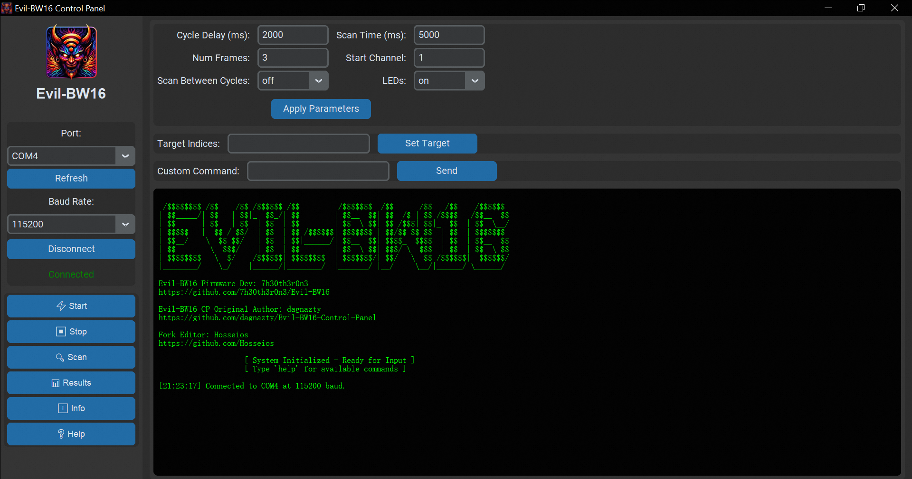

# Evil-BW16

Evil-BW16 is a powerful and automated dual-band Wi-Fi deauther capable of targeting 2.4 GHz and 5.8 GHz networks. 

It is configurable and manageable via a serial interface, allowing for precise control of scanning and deauthentication operations.

## Disclaimer

This tool is intended for educational purposes and ethical penetration testing only. Unauthorized use of this tool is illegal and strictly prohibited. The authors are not responsible for any misuse of this software.

## Features

- **Dual-Band Support:** Operates on both 2.4 GHz and 5 GHz Wi-Fi frequencies.
- **Configurable Parameters:** Adjust cycle delays, scan durations, and attack intensity.
- **Targeted Attacks:** Ability to select specific access points for deauthentication.
- **Automated Cycles:** Continuously scans and attacks based on user settings.
- **Serial Control:** Manage and configure the device using simple serial commands.
- **LED Indicators:** Provides visual feedback during operation.

## Requirements

- **Hardware:**
  - BW16 Module (https://s.click.aliexpress.com/e/_oENtnjD)
  - Compatible LED indicators (optional)
- **Software:**
  - Arduino IDE (1.8.19 or higher recommended)
  - BW16 Wi-Fi Libraries

## Installation

1. Clone this repository to your local machine:
   ```bash
   git clone https://github.com/yourusername/Evil-BW16.git
   ```
2. Open the `Evil-BW16.ino` file in the Arduino IDE.
3. Install the required libraries for the BW16 module.
4. Configure your settings in the code:
   - Update `WIFI_SSID`, `WIFI_PASS`, and `WIFI_CHANNEL` to match your requirements.
5. Upload the code to your BW16 module using the Arduino IDE.

## Usage

### Commands

Commands are sent via the serial interface to control the behavior of the device. Below is the list of supported commands:

- `start` : Start the attack cycle.
- `stop` : Stop the attack cycle.
- `scan` : Perform a Wi-Fi scan and display the results.
- `set <key> <value>` : Update configuration parameters. Supported keys:
  - `cycle_delay` : Set delay between attack cycles in milliseconds.
  - `scan_time` : Set scan duration in milliseconds.
  - `num_frames` : Set the number of deauthentication frames sent per AP.
  - `start_channel` : Set the starting channel for scanning (e.g., 1 for 2.4 GHz or 36 for 5 GHz).
  - `scan_cycles` : Enable or disable scanning between attack cycles (`on` or `off`).
  - `led` : Enable or disable LEDs (`on` or `off`).
  - `target` : Specify target APs by indices (e.g., `set target 1,3,5`).
- `info` : Display the current configuration.
- `help` : Display the list of available commands.


### Graphical interface

Big thx to @dagnazty for the work : 
https://github.com/dagnazty/Evil-BW16-Control-Panel



### Example Workflow

1. Start a Wi-Fi scan:
   ```
   scan
   ```
   Review the detected networks in the serial output.

2. Target specific networks:
   ```
   set target 1,2
   ```

3. Begin the attack:
   ```
   start
   ```

4. Stop the attack:
   ```
   stop
   ```

## Configuration

Modify the following parameters in the code to customize the behavior:

- `WIFI_SSID`: SSID of the hidden access point.
- `WIFI_PASS`: Password for the hidden access point.
- `WIFI_CHANNEL`: Channel for the hidden access point.
- `cycle_delay`: Delay between attack cycles (in milliseconds).
- `scan_time`: Duration of Wi-Fi scans (in milliseconds).
- `num_send_frames`: Number of deauthentication frames sent per AP.
- `start_channel`: Starting channel for scanning.
- `scan_between_cycles`: Enable/disable scanning between cycles.
- `USE_LED`: Enable/disable LED feedback.

## Disclaimer

This tool is intended for educational purposes and ethical penetration testing only. Unauthorized use of this tool is illegal and strictly prohibited. The authors are not responsible for any misuse of this software.

## Packet injection on bw16 

https://github.com/tesa-klebeband/RTL8720dn-WiFi-Packet-Injection

## Contributions

Contributions are welcome! Feel free to fork this repository and submit pull requests.
